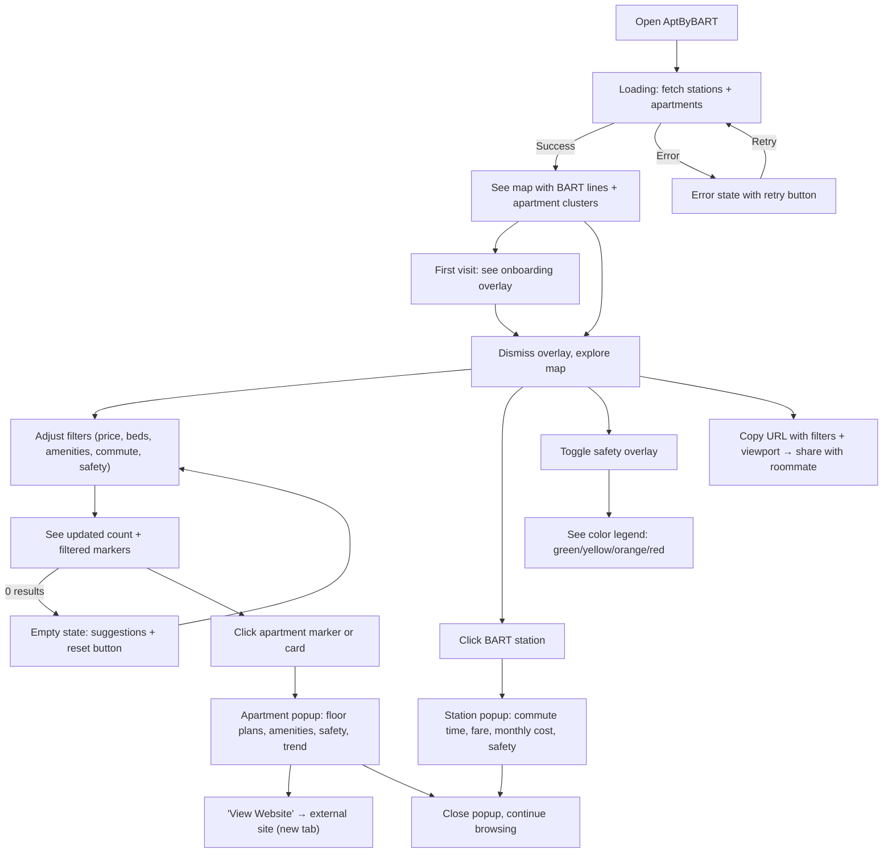

# Product User Flows

## Product Domain
AptByBART — apartment search tool for BART commuters in the SF Bay Area.

## Primary User Persona
"Alex" — renter in their 20s-30s commuting to Montgomery St via BART, balancing rent, commute time, and safety.

## Core User Journey: Find an Apartment

## Expected Step Counts
| Task | Steps | Notes |
|------|-------|-------|
| Find cheapest 1BR near BART | 3 | Open → set price range + 1BR → browse results |
| Compare safety of two stations | 4 | Open → toggle safety overlay → click station A → click station B |
| Share filtered search with roommate | 2 | Set filters → copy URL |
| View apartment details | 2 | Click marker → read popup |
| Check commute cost from a station | 2 | Click station → read fare/monthly cost |

## Data Dependencies
| User Action | Data Source | Latency |
|-------------|-----------|---------|
| Page load | GET /api/stations + GET /api/apartments | ~200ms (cached) |
| Click apartment | GET /api/apartments/:id | ~100ms |
| Filter change | Client-side recompute | <200ms (no API call) |
| Toggle safety | Client-side layer toggle | Instant |

## Accepted Tradeoffs
- All apartments fetched on initial load (works for <5000 apartments, may need viewport-based fetching later)
- Commute times are pre-computed to Montgomery St only
- Price history limited to 90 days

## Last Reviewed: 2026-04-09
