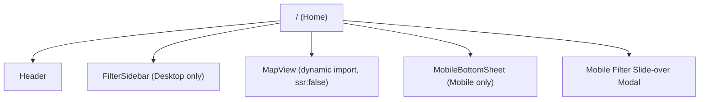

# Product Information Architecture

## Product Domain
AptByBART — interactive map for finding affordable, safe apartments near BART stations in the SF Bay Area, optimized for commuters.

## Primary User Persona
"Alex" — a 20-30 year old Bay Area renter working in SF's Financial District, commuting via BART daily, balancing rent, commute time, and neighborhood safety.

## Route Map
Single-page application (SPA). One route: `/`

## Navigation Structure

### Desktop (≥1024px)
- Header: Logo "AptByBART" (left), About link (right)
- Left sidebar (360px): Filter controls + scrollable apartment list
- Map area: Full interactive map with overlays

### Mobile (<1024px)
- Header: Logo (left), Filter button + menu (right)
- Full-screen map
- Bottom sheet: Apartment count + scrollable cards
- Filter modal: Slide-over from left on "Filter" tap

## Content Grouping
| Group | Contains | Rationale |
|-------|----------|-----------|
| Filters | Price, bedrooms, amenities, commute, safety | All search criteria together |
| Map Layers | BART lines, stations, apartment markers, safety overlay | Visual data layers |
| Popups | Station info, apartment detail | Contextual detail on click |
| Results | Apartment cards (sidebar/bottom sheet) | Browseable list synced with map |

## Accepted Tradeoffs
- Single-page app (no separate pages for stations, apartments, etc.) — keeps the experience focused
- Montgomery St is the only commute destination — covers the primary use case
- No user accounts or saved searches — MVP simplicity

## Last Reviewed: 2026-04-09
